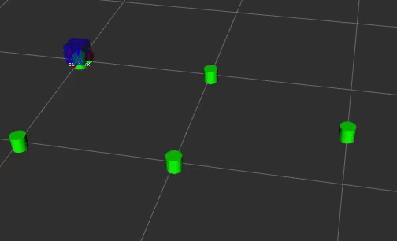

Boston Cleek

# Overview
This package contains an implementation of model predictive path integral control (MPPI) for a TurtleBot3. The average control update occurs at a rate of 50Hz.

The controls are the left and right wheel velocities. The cost function used is that same as the LQR cost. Currently, `fake_diff_encoders` and `odometer` nodes are used to simulate the robot.

# How to run
The `nuturtle_robot` package is required for the waypoint following demo. It contains the `mppi_waypoints` node. You can set the waypoints in `real_waypoints.yaml` in the `nuturtle_robot` package.

`roslaunch nuturtle_robot mppi_waypoints.launch`

# Results
The following gif is at x5 speed.

  

See a real time video of [MPPI waypoints](https://youtu.be/i_kzNi5Exsc).

# Functionality
The user specifies waypoints which are used as a reference. Each waypoint has a position
and a heading.

# Files
* mppi_params.yaml: cost function and control sampling parameters
* rk4.hpp/rk4.cpp: 4th order Runge-Kutta integration method  
* mppi.hpp/mppi.cpp: MPPI control algorithm
