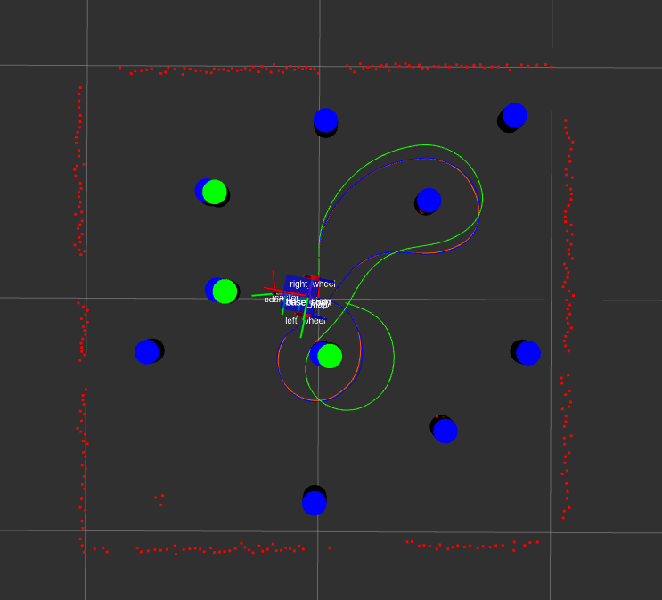
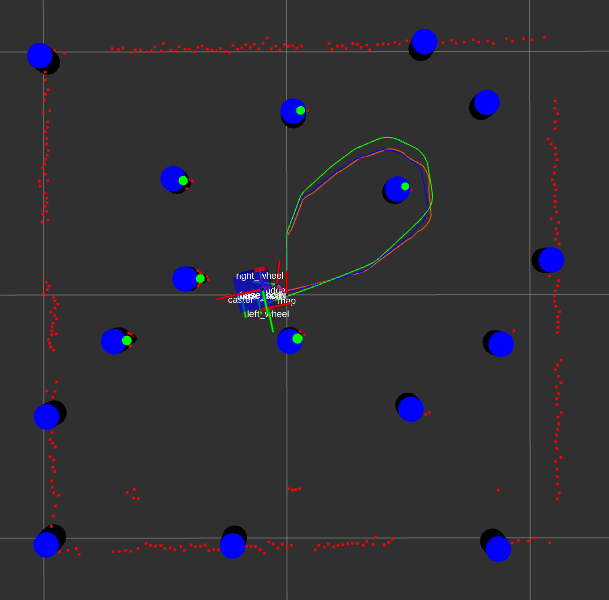

Boston Cleek

# Overview
The orange path is gazebo, the green path is odometry, and the blue path is EKF slam. The blue cylinders are the landmarks estimated by EKF slam and the green cylinders are either from the feature detector or from gazebo.

# How to run
To run with ground truth data from gazebo:

`roslaunch nuslam slam.launch debug:=true`

To run with lidar sensor and feature detection:

`roslaunch nuslam slam.launch debug:=false`

You can adjust the landmark visibility range and noise levels for the ground truth data in `landmarks.launch`. You can remove the noise completely by setting the `noise` parameter to false.

You can run the EKF with the know data or unknown data association. Set the parameter `known_data_association` in `slam.launch` to false to run with unknown data association. If running with the `known_data_association` set to true make sure to set `debug` to true as well.

# Results
## SLAM Known Data Association

landmark radius: 0.6 m
sensor noise: mean = 0.0 sigma = 0.00001

|          |      X Error (m)      |  Y Error (m) |  Yaw Error  (degrees) |
|----------|:-----------------:|---------:|-----------:|
|  Odometry  |  0.030     |   0.099    |     -7.964      |
| EKF SLAM   |     0.000      |   0.000    |     0.008       |

  

## SLAM Unknown Data Association

landmark radius: 0.6 m
sensor noise: mean = 0.0 sigma = 0.01

|          |      X Error (m)      |  Y Error (m) |  Yaw Error  (degrees) |
|----------|:-----------------:|---------:|-----------:|
|  Odometry  |  0.015     |   0.084   |     -6.975      |
| EKF SLAM   |     -0.008      |   0.038    |     -1.633      |

  

