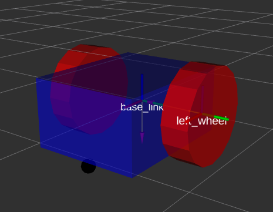

## Boston Cleek

# Description
Contains a `robot_description` for a differential drive robot that is visualized in rviz.


<p align="center">
  
</p>


# Launch
To see the differential drive robot in rviz with `joint_state_publisher` gui:

```
roslaunch nuturtle_description view_diff_drive.launch
```

and without the `joint_state_publisher` gui:

```
roslaunch nuturtle_description view_diff_drive.launch use_jsp_gui:=false
```


# Files
* diff_drive.rviz - contains rviz configurations for visualizing robot
* diff_params.yaml - contains robot's physical parameters
* diff_drive.urdf.xacro - contains visual appearance characteristics
* view_diff_drive.launch - launches rviz, robot_state_publisher, robot_description (from diff_drive.urdf.xacro), and joint_state_publisher
* CMakeLists.txt - builds code
* package.xml - defines properties about package
