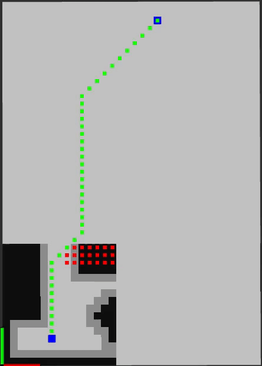
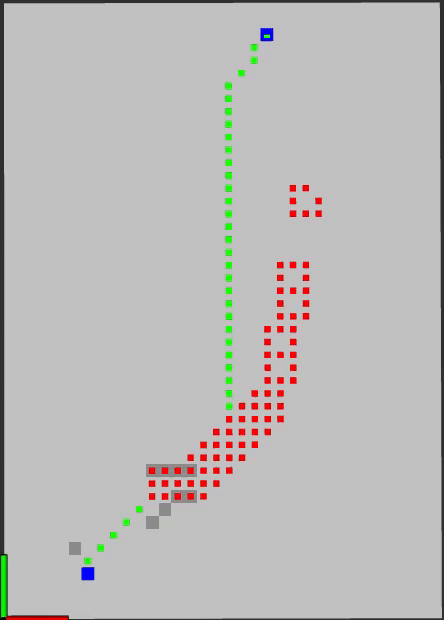
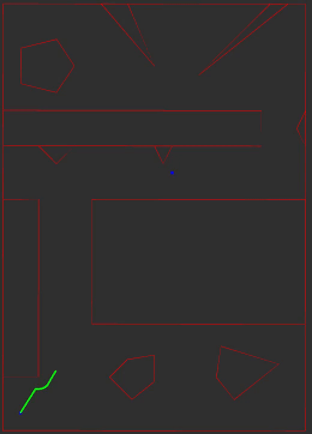
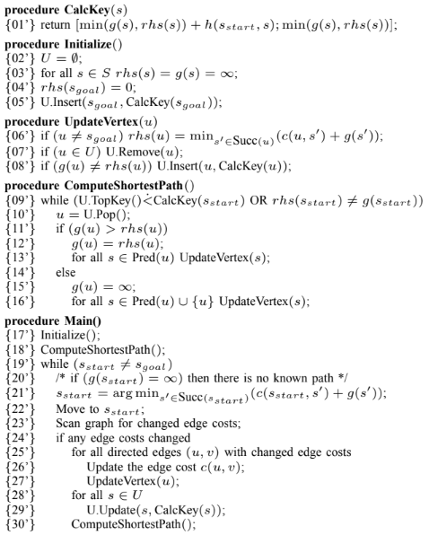
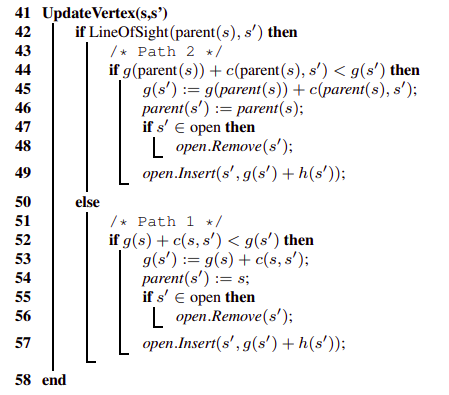
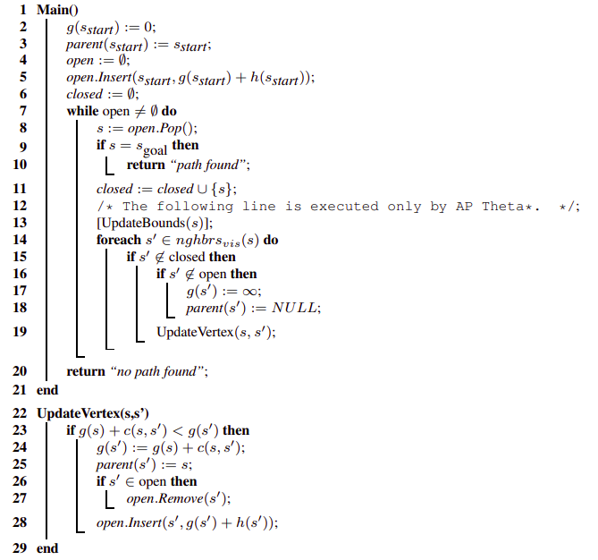
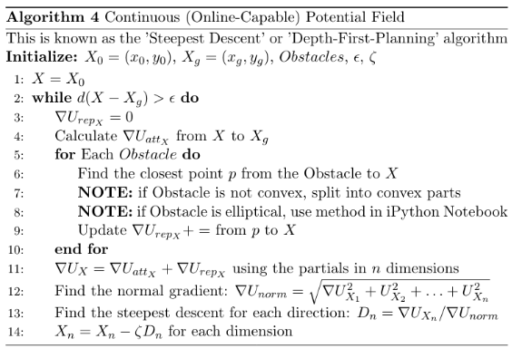

### Boston Cleek

# Overview:
This packages is apart of a larger ROS autonomous framework for the Turtlebot. This package contains implementations of D* Light on a grid, Theta* and Potential Fields in continuous space.

# How to run
D* Light:  
`roslaunch planner plan.launch plan_type:=1`

Theta*:  
`roslaunch planner plan.launch plan_type:=2`

Potential Field:  
`roslaunch planner plan.launch plan_type:=3`

# Nodes
* `grid_planner`: D* light and constructs map as a 2D occupancy grid
* `prm_planner`: constructs the probabilistic road map and finds shortest path using Theta*
* `potential_field_planner`: path planning using attractive and repulsive fields
* `draw_cont_map`: draws the map in continuous space

# D* Light
The implementation contains two internal representations of the grid map represented as a 2D occupancy grid. The first in the complete map with all the obstacles. The second map is initialized empty and obstacles are added based on the range of the visibility of the robot.

This algorithm plans from the goal to the starting cell. Originally the shortest path is the straight line to the goal. As the path front moves toward the goal obstacles come into view, the map updates, and the algorithm replans. The heuristic used here is euclidean distance.

The green cells represent the current shortest path. The red squares are the cells that are updated during the replanning stage after a map update.

## 8 cell visibility

  

## 1 cell visibility

  

# Theta* on Probabilisitc Roadmap
A probabilistic roadmap is constructed by sampling points randomly in free space and connecting them the their nearest neighbors. Theta* is similar to A* the only difference is Theta* optimizes the shortest path by skipping over nodes that can be connected by a straight line.

The roadmap show in greed was constructed using 200 nodes where each node is connected to 10 of its nearest neighbors. The shortest path is shown in blue. The heuristic used here is euclidean distance.

  

# Potential Fields
An attractive gradient pulls the path front to the goal and a repulsive gradient repels the path front away from obstacles. The next position in the path front is obtained using one step of gradient descent. The descent direction is composed by summating the attractive and repulsive gradients and normalizing the sum using the L2-norm.

The green line is the path, the blue dots are the start/goal positions, and the red lines are the obstacle edges and bounds of the map.

  

# Algorithms

## D* Light
`Koenig, Sven, and Maxim Likhachev. "Fast replanning for navigation in unknown terrain." IEEE Transactions on Robotics 21.3 (2005): 354-363.`

  

## Theta*
The following algorithm is A* the only change to Theta* is the updateVertex() function.

`Nash, Alex, et al. "Theta^*: Any-angle path planning on grids." AAAI. Vol. 7. 2007.`

  

  

## Potential Field

  

