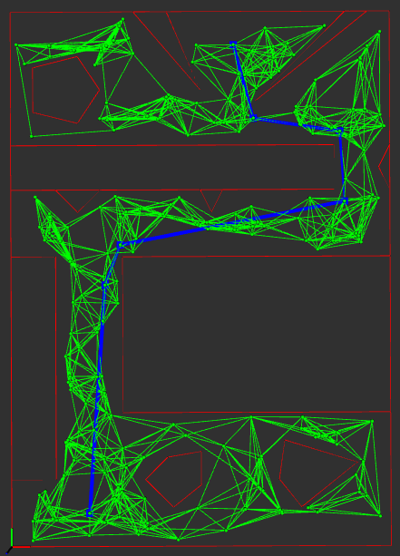
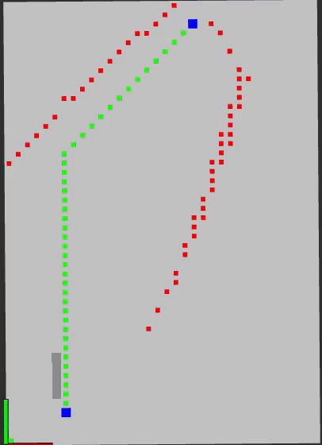

### Boston Cleek

# Overview:
A collection of shortest path planning algorithms in continuous and discrete space

# How to run
For the continuous map theta* planner:

`roslaunch planner plan.launch map:=1`

For the grid based planners:

`roslaunch planner plan.launch map:=2`

# Nodes
* `prm_planner`: searches the probabilistic road map using theta*
* `draw_cont_map` : draw the map in continuous space
* `grid_planner` : D* light and constructs map as a 2D occupancy grid

# Probabilisitc Roadmap
## Theta* Shortest Path

  

# D* Light
This algorithm plans from the goal to the starting cell. The green cells represent the current shortest path. The red squares are the cells that are updated during the replanning stage after a map update.

## 5 cell visibility

  

## 1 cell visibility

  

