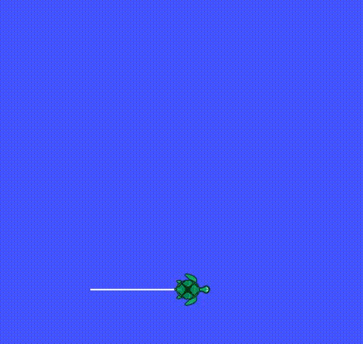
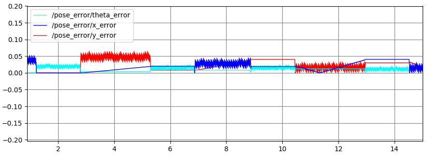
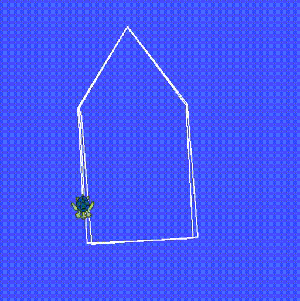
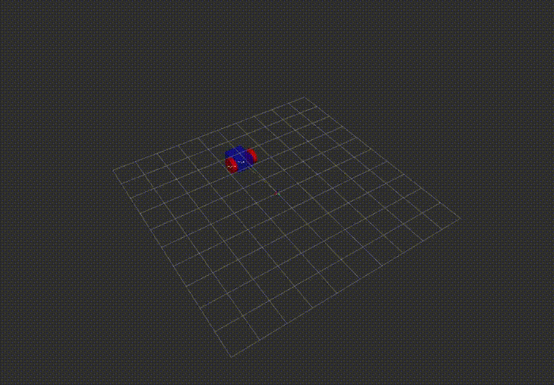
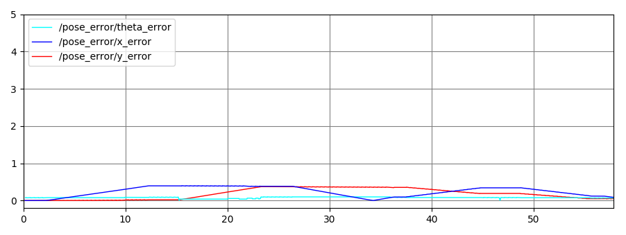

## Boston Cleek

# Description

The tsim package models the kinematics of a differential drive robot and computes
body frame twists to follow waypoints.

## Nodes


The `turtle_rect` node uses feedforward control or bang-bang control to move the turtle in turtlesim gui
in a rectangular trajectory. The `turtle_rect` node publishes controls on `cmd_vel` and the errors
in the pose are published on `pose_error`. The service `traj_reset` restarts the
turtle back at the lower left corner.

The `turtle_way` node uses bang-bang control to generate a body twist to move the turtle in a pentagon. This node uses `feedforward()` in the DiffDrive class to model the kinematics.

The nodes bellow are a part of the `rigid2d` package but are launch from `tsim` using `turtle_odom.launch`.
The `odometer` node subscribes to `sensor_msgs/JointState` on `joint_states`. It publishes an `odom ` message on `nav_msgs/Odometry` that represents the transoform between the odom frame and the body frame and the twist in the body frame. It also broadcasts a `geometry_msgs/TransformStamped` using a tf2 broadcaster. It uses `updateOdometry()` in the DiffDrive class to model the kinematics. This function is updated using the encoder reading that are updated based on the subscriber to the `joint_states` topic.

The `fake_diff_encoders` node  subscribes to `geometry_msgs/Twist` on `cmd_vel`. It uses the `feedforward()` in the DiffDrive class to model the kinematics to update its belief of the current pose. It publishes a `sensor_msgs/JointState` on `joint_states` which corresponds to the wheel encoder readings.


# Commands
To launch turtlesim and the `turtle_rect` node using rqt_plot:

```
roslaunch tsim trect.launch plot_gui:=True
```

To restar the turtle at the beginning:

```
rosservice call /traj_reset
```

To launch the `turtle_way` node with rqt_plot:

```
roslaunch tsim turtle_pent.launch plot_gui:=True
```

To launch `turtle_way`, `fake_diff_encoders`, `odometer`, and to visualize the differential drive car in rviz:

```
roslaunch tsim turtle_odom.launch
```

To see the error in the pose relative to `turtlesim`:

```
roslaunch tsim turtle_odom.launch plot_gui:=True
```


# Files
* tsim_node.cpp - the implementation of the control loop and the `turtle_rect` node
* turtle_way_node.cpp - the `turtle_way` node
* turtle_params.yaml - parameters for the trajectory
* turtle_params.yaml - joint and frame ids
* diff_drive_odom.rviz - differential drive robot with odom as fixed frame
* trect.launch - launches the simulation
* turtle_odom.launch - launched the following nodes: `turtle_way`, `fake_diff_encoders`, `odometer`
* turtle_pent.launch - launches the `turtle_way` node
* PoseError.msg - custom message containing the pose error
* CMakeLists.txt - cmake for tsim package
* package.xml - package xml


# Results
## Rectangular Trajectory
Here is a [video of the turtle](https://youtu.be/xHwiSVRySiA) completing one cycle around the trajectory and near the end I call the `/traj_reset` service.

Error plot of one full trajectory using the feedforward controller.

The turtle completing one trajectory using feedforward control.

<p align="center">
  
</p>

The turtle completing one trajectory using bang-bang control.

<p align="center">
  
</p>

<p align="center">
  
</p>

## Pentagon Trajectory

The turtle following a  pentagon of waypoints using bang-bang control to compose a body twist.


<p align="center">
  
</p>


The differential drive robot following the pentagon waypoints.

<p align="center">
  
</p>

The pose error between the kinematic model and the turtlesim pose.


<p align="center">
  
</p>
