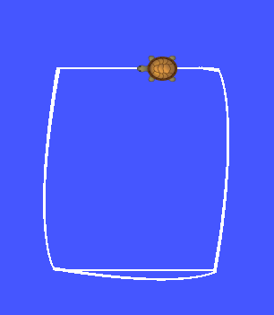
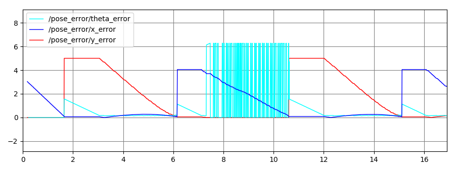
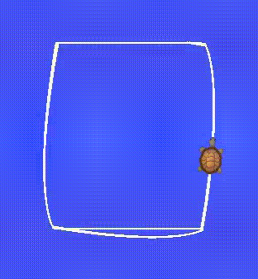

## Boston Cleek

# Description
The tsim packages uses feedforward control to move the turtle in turtlesim gui
in a rectangular trajectory. The `turtle_rect` node publishes controls on `cmd_vel` and the errors
in the pose are published on `pose_error`. The service `traj_reset` restarts the
turtle back at the lower left corner.

# Commands
To launch turtlesim and the `turtle_rect` node using rqt_plot:

```
roslaunch tsim trect.launch plot_gui:=True
```

To restar the turtle at the beginning:

```
rosservice call /traj_reset
```

# Files
* tsim_node.cpp - the implementation of the control loop and the `turtle_rect` node
* turtle_params.yaml - parameters for the trajectory
* trect.launch - launches the simulation
* PoseError.msg - custom message containing the pose error
* CMakeLists.txt - cmake for tsim package
* package.xml - package xml


# Results

<!-- <p align="center">
  
</p> -->

Error plot of one full trajectory. The oscillation is due to the turtle overshooting the heading at the top of the rectangle.

<p align="center">
  
</p>

<p align="center">
  
</p>
